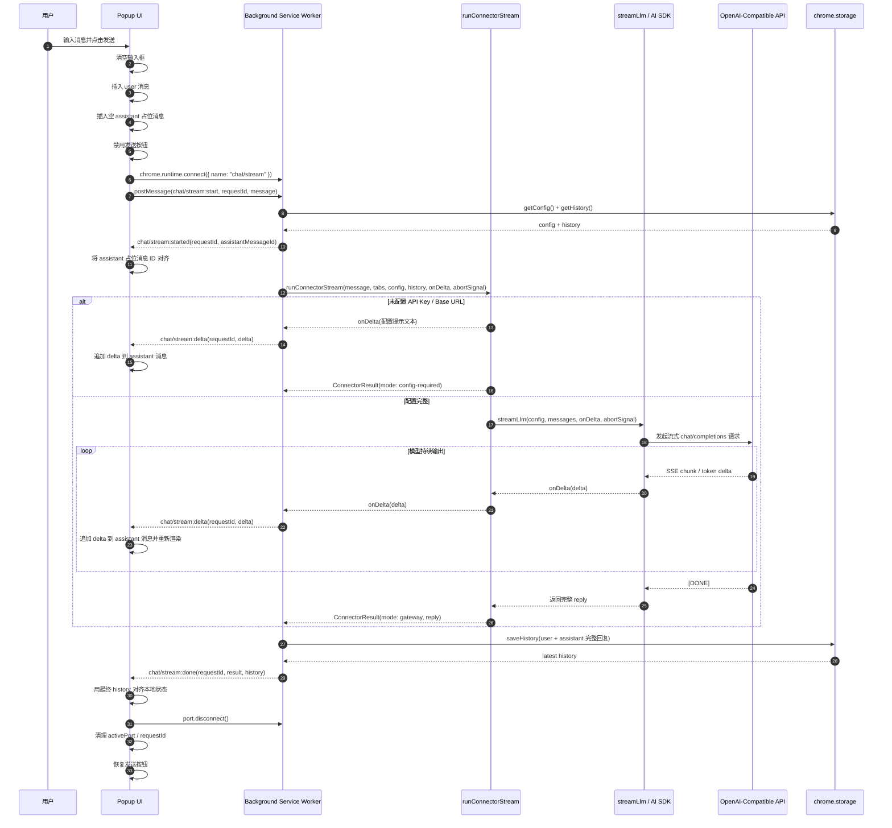
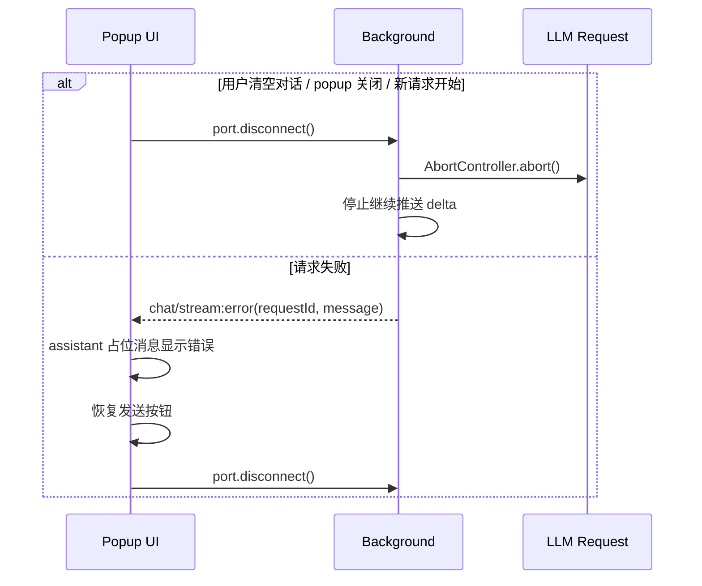

# 流式聊天输出时序

本文档总结 `popup` 通过 `chat/stream` Port 与 `background service worker` 交互时的流式输出流程。

## 正常流程

## 异常与取消流程

## 关键约定

- `requestId` 用于过滤过期事件，避免旧请求污染当前 UI。
- `assistantMessageId` 用于把后台最终保存的 assistant 消息与 popup 中的占位消息对齐。
- `chat/stream:delta` 携带文本增量和 `deltaType`；普通回答使用 `answer`，思考内容使用 `reasoning`。
- `reasoning` 可来自标准 reasoning 流，也可由 `<think>...</think>` 文本段解析得到。
- 最终完整回复以 `chat/stream:done.result.reply` 和 `history` 为准。
- assistant 历史消息可保存 `reasoning` 字段，popup 重开后仍能显示思考过程。
- Port 断开会触发后台 `AbortController.abort()`，用于取消仍在进行中的大模型请求。
