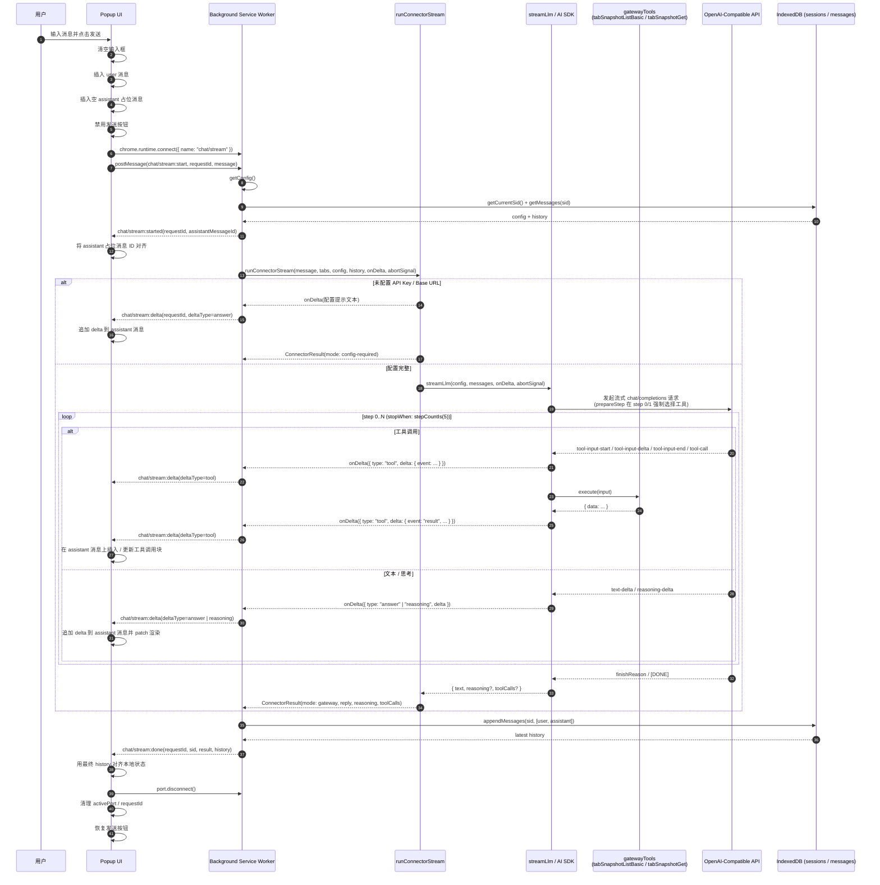
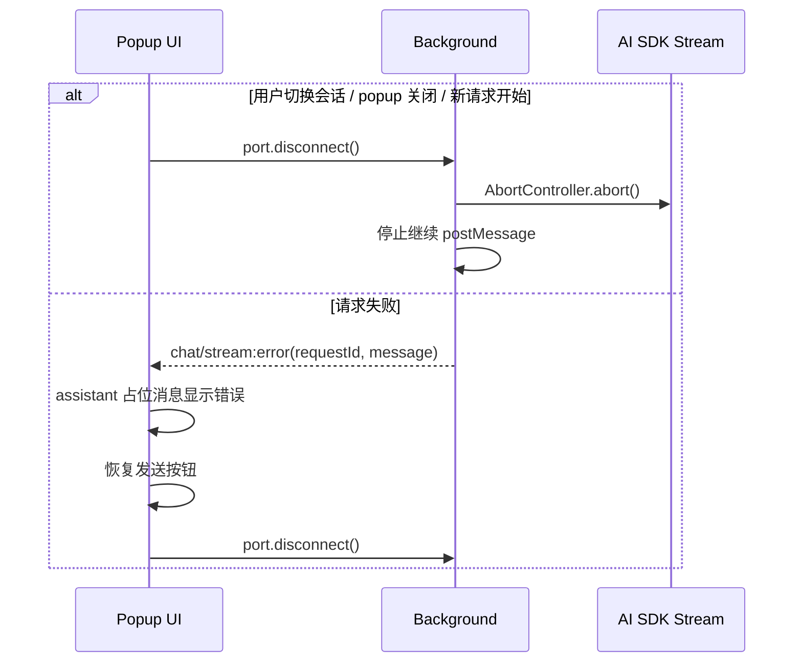

# 流式聊天输出时序

本文档总结 `popup` 通过 `chat/stream` Port 与 `background service worker` 交互时的流式输出流程，包含工具调用与会话相关细节。

## 正常流程

## 异常与取消流程

## 关键约定

- `requestId` 用于过滤过期事件，避免旧请求污染当前 UI。popup 在 `chat-stream-controller.ts` 中只处理 `message.requestId === activeRequestId` 的事件。
- `assistantMessageId` 用于把 background 最终保存的 assistant 消息与 popup 中的占位消息对齐；popup 当前直接用本地生成的占位 ID，等 `chat/stream:done` 后再用 history 对齐。
- `chat/stream:delta` 携带文本增量与 `deltaType`：
  - `answer`：普通回答文本
  - `reasoning`：思考过程文本（可来自标准 reasoning 流或 `<think>...</think>` 解析）
  - `tool`：工具调用过程事件，`delta` 是结构化对象（`call` / `input-start` / `input-delta` / `input-end` / `result` / `error`）
- popup 只在收到 `result` / `error` 时把工具调用追加进 assistant 消息的 `toolCalls`（与 background 持久化策略一致）。
- 最终完整回复以 `chat/stream:done.result.reply` 与 `history` 为准；popup 应当用 `history` 重新渲染整列消息，避免增量与最终结果不一致。
- `chat/stream:done` 同时返回 `sid`，方便前端确认对应的是哪条会话。
- AI SDK 在 `prepareStep` 中强制：step 0 必须调用 `tabSnapshotListBasicTool`，step 1 必须调用 `tabSnapshotGet`，从 step 2 起允许自由选择；整轮步数受 `stopWhen: stepCountIs(5)` 约束。
- assistant 历史消息会保存 `reasoning` 和 `toolCalls`（仅 `result` / `error` 事件），popup 重开后仍能显示思考过程与工具调用结果。
- Port 断开会触发 background 的 `AbortController.abort()`，用于取消仍在进行中的 AI SDK 请求；正在执行的工具不会被 abort（由 AI SDK 内部决定）。
- 用户在流式输出过程中切换会话时，popup 会先调用 `stopChatStream()` 主动断开 Port，再用新的 `chat/state:get` 对齐 UI。
